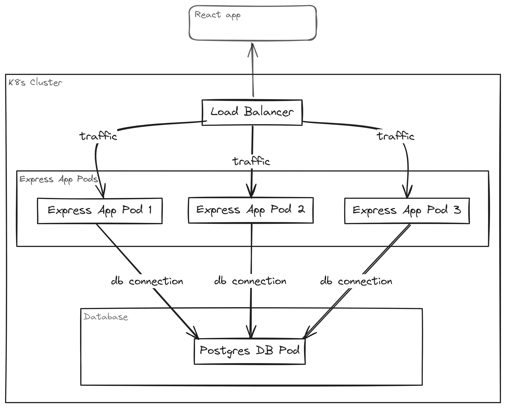
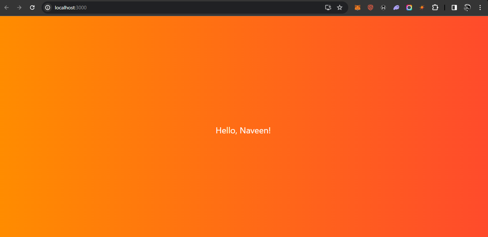
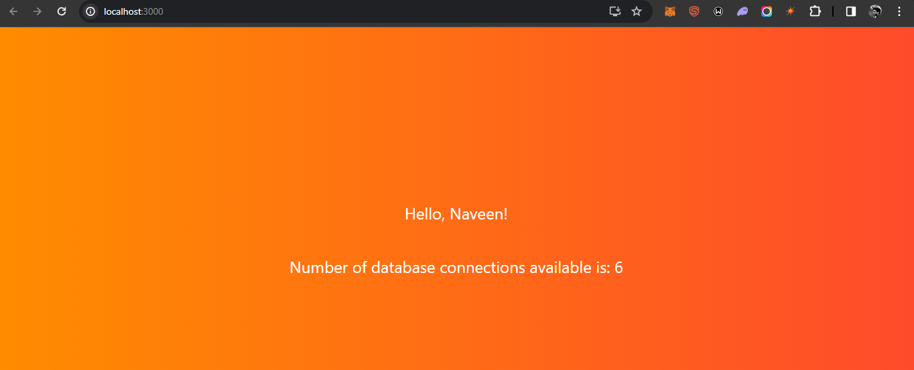

# bdiplus-3-tier-web-app-k8s (# PostgreSQL Connection Monitor)
This repository contains the code and configuration files necessary to deploy a 3-tier web application using Docker and Kubernetes to monitor PostgreSQL DB Connection.

[](https://opensource.org/licenses/MIT)

## Overview

This project integrates PostgreSQL as the database, Express.js as the Node.js application framework, and React for the frontend. The primary functionality involves querying the PostgreSQL database to fetch the number of available connections and exposing this information through a REST API endpoint "/connections". The React app then displays this dynamic connection count, providing a real-time overview of the database's connection status. Easily monitor and manage your PostgreSQL database connections with this intuitive and responsive web application.

## Prerequisites

- Node.js and npm
- Express.js: `npm install express`
- CORS Middleware
- Axios (HTTP client for React)
- PostgreSQL Database Connection Details
- Docker Desktop
- Kubernetes (K8s)
- kubectl: `winget install kubectl`

### Kubernetes Architecture


## Installation

### Clone the Repository
```sh
git clone https://github.com/NaveeN-929/bdiplus-3-tier-web-app-k8s
cd bdiplus-3-tier-web-app-k8s
```

### Manual Set-up React App
```sh
cd UI
npm install
npm start

(or)

docker login
docker build . -f Dockerfile -t <repo-name>/<image-name>:<tag>
docker push <repo-name>/<image-name>:<tag>

docker run -p 3000:3000 <repo-name>/<image-name>:<tag> -d
```
Verify the React app:
- Open your browser and navigate to [http://localhost:3000](http://localhost:3000)
  
  

### Set-up PostgreSQL DB Container
```sh
cd ~
kubectl apply -f postgres.yml
kubectl get pods -n default
kubectl get services -n default # Note the IP address of the PostgreSQL service
```

### Set-up Express App
1. Navigate to the Express app directory:
   ```sh
   cd APP
   ```
2. Edit the `app.js` file to update the PostgreSQL connection details:
   ```js
   // In app.js, update the host field with the PostgreSQL IP
   host: '<paste the PostgreSQL IP>'
   ```

### Build the Docker Image
```sh
docker login
docker build . -f Dockerfile -t <repo-name>/<image-name>:<tag>
docker push <repo-name>/<image-name>:<tag>

docker run -e <PG_HOST="IP-add"> -p 8080:8080 <repo-name>/<image-name>:<tag> -d
```

### Create the K8s Pods
```sh
kubectl apply -f express-app.yml
kubectl get pods -n default
```
Verify the Express app:
- Open your browser and navigate to [http://localhost:8080/connections](http://localhost:8080/connections)

Verify the React app:
- Open your browser and navigate to [http://localhost:3000/connections](http://localhost:3000/connections)
  
  

## Terminate the Created Resources
```sh
kubectl delete -f <file-name.yml>
```

#
### Docker-compose way
```sh
cd ~
docker compose -f .\dockercompose.yml up -d
docker ps -a
```
## Terminate the Created Resources
```sh
docker compose -f .\dockercompose.yml down --remove-orphans
```
#
### K8s way
```sh
cd k8s
kubectl apply -f 3t.yml
```

## Terminate the Created Resources
```sh
cd k8s
kubectl delete -f 3t.yml
```

#
### K8s way using Terraform
```sh
cd terraform
terraform init
terraform plan
terraform apply
```

```sh
kubectl get pods -n app
kubectl get svc -n app
kubectl get endpoints -n app postgres
```